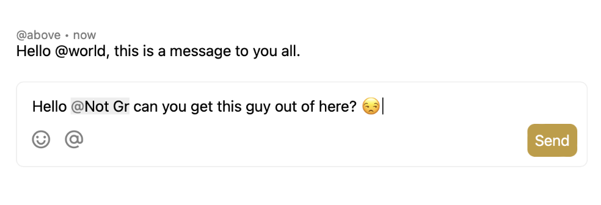

# react-chat-input

The missing chat input for React.



- 🌀 Mentions
- 📑 File attachments
- 😊 Emoji picker

## API

```jsx
<ChatInput
  autoCompleteProfiles={autoCompleteProfiles}
  enableFormatting={false}
  files={files}
  onFilesChange={(files) => setFiles(files)}
/>
```

Please look at the [input stories](./src/components/ChatInput.stories.module.css) on the possible props/definitions.
